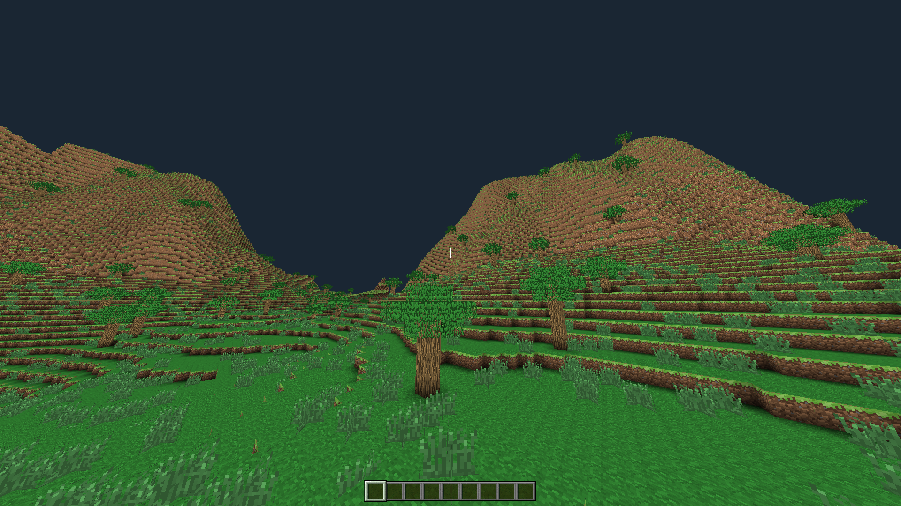
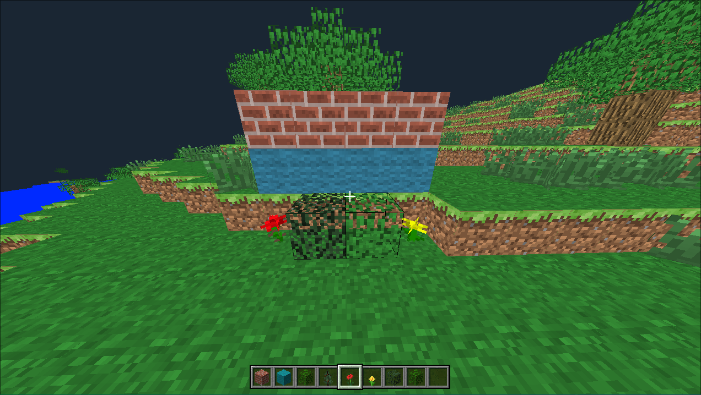

# Minecraft clone (C++)

A from-scratch implementation of a Minecraft-style voxel game built entirely in C++ with sdl2 for learning and practice purposes.

## Screenshots




## Features

- Procedural terrain generation using Perlin noise
- Biome system based on temperature and humidity
- Basic trees and vegetation generation
- Chunk-based world system (16x512x16)
- Greedy meshing, face culling and frustum culling for optimized geometry generation
- Multithreaded chunk generation and mesh building
- Basic UI with inventory and hotbar
- Block placement and removal

## Build

Clone this project and run:

```bash
mkdir build
cd build
cmake ..
make && ./MineClone
```

### Controls

Controls are currently hardcoded.The default bindings are:

### Player

| Key / Input | Action                  |
| ----------- | ----------------------- |
| W A S D     | Move                    |
| Space       | Move up                 |
| Left Shift  | Move down               |
| Mouse       | Look around             |
| Left Click  | Remove block            |
| Right Click | Place block             |
| Mouse Wheel | Change hotbar selection |
| 1 – 9       | Select hotbar slot      |
| E           | Open / close inventory  |
| ESC         | Toggle menu             |
| Key / Input | Action                  |

### Debug Camera

| Key / Input | Action                  |
| ----------- | ----------------------- |
| P           | Enable debug camera     |
| O           | Disable debug camera    |
| Arrow Keys  | Move                    |
| U           | Move up                 |
| Right Shift | Move down               |
| Right Ctrl  | Increase movement speed |
| Mouse       | Look around             |
